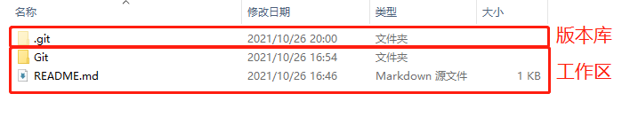
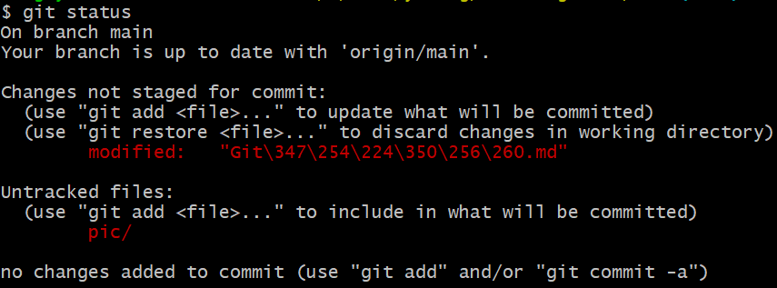
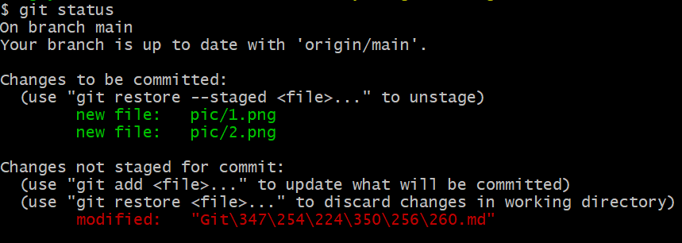
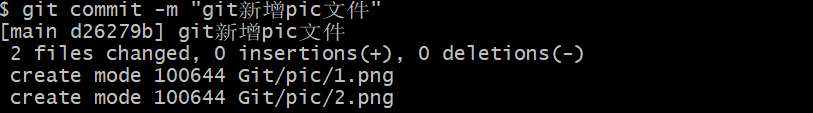
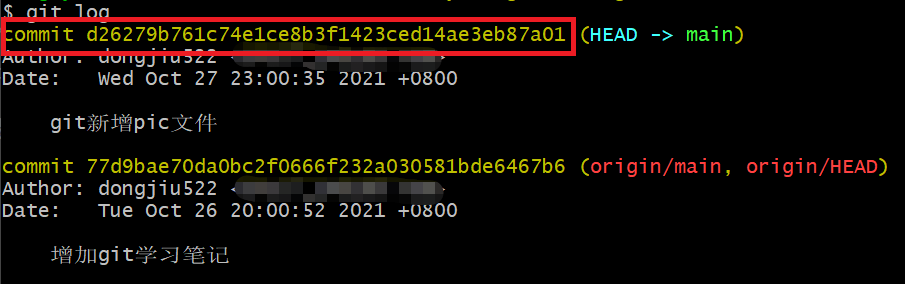
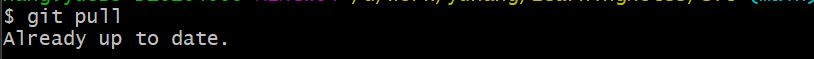
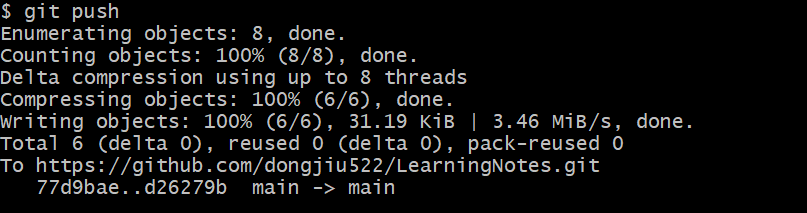
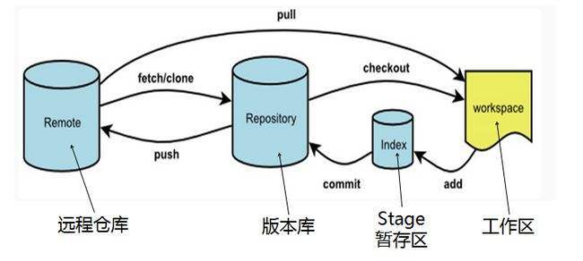
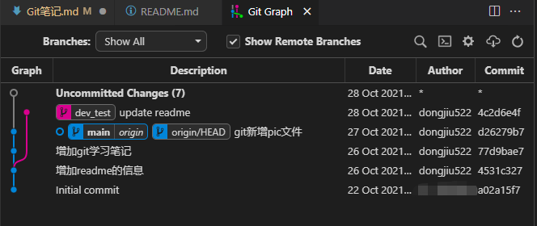

# Git 笔记
##  目录
  - [简介](#简介)
  - [概念](#概念)
  - [工作流程](#工作流程)
  - [流程、命令与图解](#流程命令与图解)
  - [常用命令](#常用命令)
  - [复杂一些的命令](#)

## 简介
Git 是一个开源的分布式版本控制系统，可以有效、高速地处理从很小到非常大的项目版本管理。
版本控制系统一般分为三大类：本地版本控制系统，集中式版本控制系统和分布式版本控制系统。
>- **本地版本控制系统** 
>本地版本控制是将文件的各个版本以一定的数据格式存储在本地的磁盘，这种方式在一定程度上解决了手动复制粘贴的问题，但无法解决多人协作的问题。
>- **集中式版本控制系统** 
>集中式版本控制相比本地版本控制没有什么本质的变化，只是多了个一个中央服务器，各个版本的数据库存储在中央服务器，管理员可以控制开发人员的权限，而开发人员也可以从中央服务器拉取数据。集中式版本控制虽然解决了团队协作问题，但缺点也很明显:所有数据存储在中央服务器，服务器一旦宕机或者磁盘损坏,会造成不可估量的损失。
>- **分布式版本控制系统** 
>分布式版本控制与前两者均不同。在分布式版本控制系统中，保存的是文件的快照，即把文件的整体复制下来保存，而不关心具体的变化内容。最重要的是分布式版本控制系统是分布式的，当你从中央服务器拷贝下来代码时，你拷贝的是一个完整的版本库，包括历史纪录，提交记录等，这样即使某一台机器宕机也能找到文件的完整备份。所以每一份仓库的拷贝都是一样的。

版本控制的目的是为了对文件的状态进行追踪，能够记录文件的变化历史。对于Git来说，它本身保存的是文件当前的完整状态（别的版本控制工具可能记录的是当前状态跟之前的状态的差异），并由此状态生成一个HASH值作为此状态的唯一id。随着文件不断的被修改并记录，则生成了文件变化的历史记录，也就是仓库。

## 概念
- 远程仓库
  - 存放于远端的仓库。可以是远程网络的一端，也可以是存放于其它目录的公共仓库
- 本地仓库
  - 存放于本地路径下的个人仓库
- 版本库
  - 存储着文件状态变化历史的集合
- 工作区
  - 本地仓库下的目录
- 暂存区
  - 版本库中暂时用来缓存文件的区域
- 提交
  - 一次文件变化的记录
- 分支
  - 记录着文件每一次提交
- 对象库
  - git对数据的记录是存储在对象库中的
- HEAD
  - 在分支中，指向当前的状态的状态点

## 流程、命令与图解
1. 克隆远程仓库到本地，作为工作目录。如下图 
   git clone <https://github.com/dongjiu522/LearningNotes.git>
    
2. 从仓库中摘取出你想要的工作分支 
    git checkout main 
    **注** : main 为此试例的分支 
3. 修改或者增加本地文件 
   此处修改你需要修改的文件即可 
4. 查看修改后的文件状态 
   git status 
    
   表明Git笔记.md文件被修改过。pic目录是没有被记录追踪的 

5. 将修改添加到暂存区 
   git add pic 
   git status 
   
   新增加了两个文件来记录追踪 
6. 将修改提交到本地仓库 
7. git commit -m "git新增pic文件" 
    
   将添加到暂存区的修改，正式提交到本地版本库中。 -m 参数是添加提交信息的意思 
8. 查看提交记录 
   git log 
    
   红框标记是这次提交的唯一id，hash值 
9.  同步远程仓库到本地仓库，如果有冲突需要在本地解决冲突 
   git pull 
    
   其他人没有更新，也就是本地跟远程是一致的，最新的 
10. 将本地仓库修改好的分支推送到远端 
    git push 
     
   **注**：同步远程仓库到本地时，只能在分支上同步。不然会在一个历史状态点上进行代码合并。导致本地的修改是在一个状态点上，从而不能推送。 
11. 以上流程回顾 
    
   版本库和暂存区都是存放于上边图的.git目录下 
12. 概念理解 
     
    现在看到的是仓库的一个图，记录了追踪记录的文件的历史变化状态。图中左侧有两条线，是两个git分支，一条为蓝色，名叫dev_test，一条为红色,名叫main。从下往上看是其变化的流程。线上的每一个点，是所有追踪文件的一个状态，并有一个唯一的id（hash值），即commit id。一个一个状态点串联，也就形成了红色或者蓝色的线，即分支。一般的工作都是在分支上进行的，当然还有一些点曾经在分支上，后来因为一系列的操作，从分支上分离了出来，成为了游离点，git 认为这些游离点是垃圾(并不认同)。分支可以分叉也可以合并，图上是一个分叉的例子。如果两个人同时对同一个分支进行修改，则他们就会分开不一样的线路，然后经过两个分支的合并，他们又重新回到同一个分支上来。 
   
## 常用命令
| 命令 | 解释|
|-----|-----|
|git init [仓库名]|初始化一个空的仓库|
|git clone 仓库地址|从已有的仓库克隆一份。地址可以是路径地址，网络地址或者某种协议的地址|
|git config |用来进行git的参数配置|
|git add |添加文件到仓库|
|git status	|查看仓库当前的状态，显示有变更的文件|
|git diff	|比较文件的不同，即暂存区和工作区的差异。文本文件中增加的行前缀标记为+++，删除的行前缀标记为---|
|git commit	|提交暂存区到本地仓库|
|git reset	|回退版本|
|git rm	|删除工作区文件|
|git mv	|移动或重命名工作区文件|
|git log	|查看历史提交记录|
|git remote	|远程仓库操作|
|git fetch	|从远程获取代码库|
|git pull	|下载远程代码并合并|
|git push	|上传远程代码并合并|
|git branch [参数] |不传参默认是查看分支，*标记的为当前分支。传参-d branchname为删除分支。传参branchname为以当前节点状态创建一个新的分支|
|git checkout branchname | 切换到仓库中另外一个分支上去，并更新工作区|
|git merge branchname | 将branchname的分支合并到当前分支|
|git tag -a target_name | 给当前节点状态打一个target，也就是起一个别名，方便标记|

